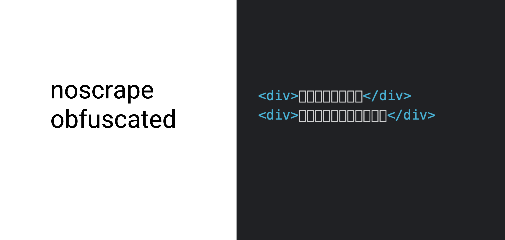
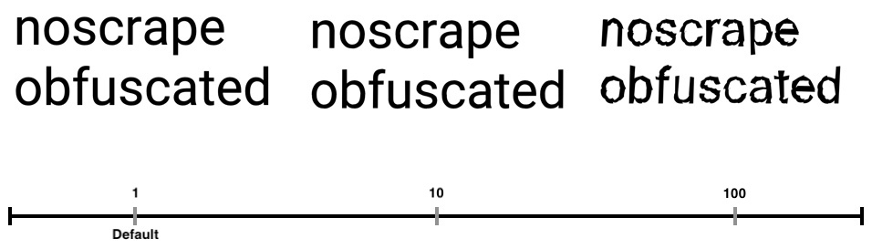

<br />
<br />

[](https://github.com/schoenbergerb/noscrape/releases/)
[](#license)
[](https://github.com/schoenbergerb/noscrape/issues)


<br />
<br />


# Project Goal 

### this project should help you to prevent anyone from scraping your content

<br />
<br />
<br />

# Concept
The key behind is to use any true-type font from which _noscrape_ generates a new version with shuffeld unicodes and nothing what one can use to calculate them back. Strings and Integers become obfuscated and are only readable by using the generated obfuscation-font.

<br /><br />
What we cannot remove from inside the font are the glyph-paths. At the moment the paths are obfuscated by shifting them randomly a little bit _( @see [obfuscation strength multiplier](#strength) )_ that makes it hard to calculate them back but not impossible or maybe "guessable" by a ML-Algorithm.<br /> Would be nice if someone come up with a better solution or help to improve this 😅


<br />
<br />
<br />

# _IMPORTANT NOTE_

Bots are not able to process obfuscated text or it comes to unpredictable analytics results etc. 
<br>
So please beware of using this technology on relevant content for indexed pages!
<br />
<br />
Doing the whole obfuscation stuff tooks time (something around 50-60ms on my machine 😉).<br>
This should not be problem with prerendered pages. For API-Requests, one sould consider putting obfuscation logic into a cronjob like task and use them multiple times instead of calculate everything again for every request.
<br />
<br />
<br />


# Example

```typescript
// server-side obfuscation
const object = { title: "noscrape", text: "obfuscation" }
const { font, value }  = obfuscate<any>(object, 'path/to/your/font.ttf')

```
⬇⬇⬇⬇ provide data ⬇⬇⬇⬇
```javascript
// font will be provided as buffer
const b64 = font.toString(`base64`)
```
```html
<!-- client-side visualization-->


<style> 
    @font-face {        
        font-family: 'noscrape-obfuscated';        
        src: url('data:font/truetype;charset=utf-8;base64,${b64}');    
    }
</style>

...

<span style="font-family: noscrape-obfuscated">
    <div>{ value.title }</div>
    <div>{ value.text }</div>
</span>    
```

<br />

[example-code](https://github.com/schoenbergerb/noscrape-example) 

[live demo](https://noscrape-nexample.vercel.app) 
<br />
<br />
<br />

# Options

<br />

## strength
     * obfuscation strength multiplier ( default: 1 )
     * all under 0.1 makes no sense ( paths can be simply back calculated )
     * all over 10 makes no sense ( looks like 💩 )



<br />
<br />

## characterRange
[character range](https://www.ling.upenn.edu/courses/Spring_2003/ling538/UnicodeRanges.html) used for encryption


- PRIVATE_USE_AREA &nbsp;&nbsp;&nbsp;&nbsp;&nbsp; ___DEFAULT___
- LATIN
- GREEK
- CYRILLIC
- HIRAGANA
- KATAKANA

<br />
<br />
<br />

# Contributions

Contributions, issues and feature requests are very welcome. If you are using this package and fixed a bug for yourself, please consider submitting a PR!

<br />
<br />
<br />

# License

[MIT](https://github.com/schoenbergerb/noscrape/blob/main/LICENSE) @ Bernhard Schönberger
