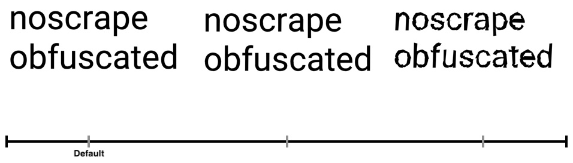

# noscrape (ALPHA)

<br />
<br />


## project goal

this projects goal is to provide an infrastructure to create an obfuscated font (public-key) and a lookup json (private key) 
to prevent anyone to scrape content from your obfuscated html output.


<br />
<br />
<br />

## _IMPORTANT NOTE_

Bots are not longer able to process obfuscated text or it comes to unpredictable analytics results etc. 
<br>
So please beware of using this technique on relevant content for indexed pages!

<br />
<br />
<br />

## Usage

```typescript
const object = { some: "strings", to: "translate" }

const css = translate(object, 'path/to/your/font.ttf')
```

translate will obfuscate all string values within given object and return a little css code like that:
```css
@font-face {       
    font-family: 'noscrape-obfuscated';       
    src: url('data:font/truetype;charset=utf-8;base64,T1RUTwAJAIAAAwAQQ0ZGIOr...');    
}
```

the css - code have to be inserted in your html within a `<style />` - tag

and all you have to do now is insert the obfuscated objects values within a tag that uses `noscrape-obfuscated` as font-family

<br />
<br />
<br />

## Example

```typescript

const object = { some: "strings", to: "translate" }

const css = translate(object, 'path/to/your/font.ttf')

```
...
```html
<style> { css } </style>
```
...
```html

<span style="font-family: noscrape-obfuscated">
    { object.some}
</span>    
```

<br />
<br />
<br />

## Properties

<br />

#### **strength** ( default: *1* )
     * obfuscation strength multiplier ( default: 1 )
     * all under 0.1 makes no sense ( paths can simply be rounded and so back calculated )
     * all over 10 makes no sense ( looks like 💩 )

